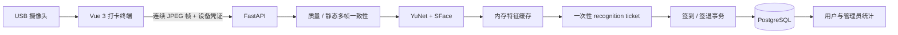

# LabTime 实验室人脸识别打卡系统

LabTime 是一个面向固定实验室电脑和 USB 摄像头的完整一期实现。前端使用 Vue 3，后端使用 FastAPI，支持人脸录入与审批、现场识别、签到/签退状态机、有效时长统计、异常修正、用户/管理员权限、独立终端身份和审计日志。

> 人脸特征属于敏感生物识别信息。本项目只持久化 AES-256-GCM 加密后的特征向量，采集的图片只在请求内存中处理，不保存到数据库、磁盘或日志。正式部署前仍须完成个人信息保护影响评估、单独同意、撤销与删除流程。

## 功能状态

- 用户：账号登录、个人首页、当前在实验室状态、今日/本周/本月时长、趋势、历史考勤、人脸自助录入并自动激活、修改密码。
- 管理员：数据总览、用户创建/编辑/停用/重置密码、人脸监督录入、待审批人脸现场复验、批准/拒绝/撤销、考勤筛选、补充签退、作废、时长排名与 CSV 导出、终端管理、审计日志。
- 终端：一键启用本机、实时识别工作台、摄像头选择、静态多帧人脸核验、当前在场名单、今日记录、一次性识别凭证和自动签到/签退。
- 后端：Argon2id 密码、短期 JWT、HttpOnly 轮换刷新令牌、RBAC、设备鉴权、加密模板缓存、事务和幂等、漏签退任务、跨上海自然日统计。
- 工程：SQLAlchemy 2、Alembic、PostgreSQL/SQLite、Docker Compose、Nginx 同域代理、HTTPS 配置、Pytest、Vitest、TypeScript 检查。

## 架构



数据库是加密特征向量的唯一持久化来源。后端启动时将活动模板解密到进程内存；人脸批准、替换或撤销后立即刷新缓存。

## 目录

```text
.
├─ frontend/                 Vue 3、终端和管理页面
├─ backend/                  FastAPI、模型、迁移和测试
├─ models/                   本地只读模型目录（不提交 ONNX）
├─ deploy/                   HTTPS Nginx 配置和证书挂载目录
├─ docker-compose.yml        本地/服务器容器编排
├─ docker-compose.prod.yml   HTTPS 生产覆盖配置
├─ .env.example              配置模板
└─ THIRD_PARTY_NOTICES.md    第三方许可清单
```

## 本地开发

### Windows 一键启动

直接双击项目根目录的 `一键启动.bat`。脚本会：

1. 检查 Python 3.12+ 和 Node.js 20+。
2. 首次运行时自动创建 `.venv` 并安装缺失依赖。
3. 同时启动 FastAPI（默认 8000）和 Vue（默认 5173）；端口被占用时自动寻找后续空闲端口。
4. 自动打开 <http://localhost:5173>。

保持启动窗口开启，按 `Ctrl+C` 会停止本次启动的服务；也可以双击 `一键停止.bat`。如果浏览器没有自动出现，可双击 `打开系统.bat`，它会读取本次启动实际使用的端口。启动失败时窗口不会自动关闭，详细过程同时保存在 `.runtime/launcher.log`。运行状态保存在 `.runtime`，不会提交到 Git。

如只想检查环境而不启动服务：

```powershell
powershell -ExecutionPolicy Bypass -File .\scripts\start-local.ps1 -CheckOnly
```

### 1. 后端

需要 Python 3.12+。在 `backend` 目录执行：

```powershell
python -m venv .venv
.\.venv\Scripts\Activate.ps1
pip install -e ".[dev]"
python run.py
```

没有 `.env` 时默认使用 `backend/data/lab_attendance.db`。首次启动会创建开发管理员：

- 账号：`admin`
- 密码：`ChangeMe123!`

首次登录后应立即修改密码。生产环境会拒绝上述默认密码和其他开发密钥。

如果尚未下载模型，可临时设置 `FACE_ENGINE=stub` 做接口联调。Stub 仅接受测试字节，不识别真实图片，并且生产环境禁止使用。

API 文档：<http://127.0.0.1:8000/api/docs>
健康检查：<http://127.0.0.1:8000/api/health>

### 2. 前端

需要 Node.js 20+ 和 pnpm。在 `frontend` 目录执行：

```powershell
pnpm install
pnpm dev
```

打开 <http://localhost:5173>。Vite 会把 `/api` 代理到 `127.0.0.1:8000`。`localhost` 属于浏览器安全上下文，可在本机使用摄像头；通过其他局域网 IP 访问时必须配置 HTTPS。

### 3. 模型

按照 [models/README.md](./models/README.md) 下载并校验 YuNet 和 SFace：

- `models/face_detection_yunet_2023mar.onnx`
- `models/face_recognition_sface_2021dec.onnx`

启动健康检查中的 `face_engine` 应为 `ready:opencv`。若为 `unavailable:*`，人脸接口会返回 503，但账号、用户、考勤查询等非识别功能仍可开发调试。

## Docker Compose

复制并认真修改环境变量：

```powershell
Copy-Item .env.example .env
docker compose up --build -d
```

默认通过 <http://localhost:8080> 访问，适合单机验证。正式局域网部署需要：

1. 将可信证书保存为 `deploy/certs/labtime.pem` 和 `deploy/certs/labtime.key`。
2. 把 `.env` 的 `ENVIRONMENT` 改为 `production`，设置强随机 JWT 密钥、向量密钥、终端 pepper、数据库密码和 `COOKIE_SECURE=true`。
3. 写入两个模型文件的真实 SHA-256。
4. 确认 `ALLOWED_ORIGINS` 是实际 HTTPS 地址。
5. 启动 HTTPS 覆盖配置：

```powershell
docker compose -f docker-compose.yml -f docker-compose.prod.yml up --build -d
```

生产容器启动顺序为 PostgreSQL → Alembic 迁移和 FastAPI → 漏签退任务 → Nginx。数据库端口不对宿主机公开。

## 典型使用流程

1. 管理员登录并创建普通用户。
2. 管理员在“终端管理”创建终端，保存只显示一次的设备密钥。
3. 在固定电脑打开 `/kiosk/setup`，管理员点击“一键启用本机终端”；已有终端密钥时才使用高级手动配对。
4. 人脸可由管理员监督录入并直接激活；也可由用户自助提交。
5. 自助档案必须由管理员在“人脸档案”面对本人再次采集；匹配通过后的 15 分钟内才能批准。
6. 用户在终端正对摄像头完成静态扫描。没有开放会话时自动签到；已有正常开放会话时自动签退；终端成功页出现“记录已保存”才表示数据库已写入。
7. 超过 24 小时未签退的会话由任务标记为 `MISSING_CHECKOUT`，不计入正式时长。管理员依据事实补签退或作废并填写原因。

## 业务与并发保证

- 时间使用后端服务器 UTC，页面按武汉时间（UTC+8）展示。
- 每个用户最多一条 `OPEN` 或 `MISSING_CHECKOUT` 记录，由数据库部分唯一索引保证。
- 识别 ticket 绑定用户、终端、允许操作和短期有效期，并且只能消费一次。
- 签到/签退使用事务、行锁和幂等键；页面禁用按钮不是权限边界。
- 只有 `CLOSED` 记录进入正式统计，跨午夜会话按上海自然日拆分。
- 所有修正保存修改前后值、管理员、原因和时间。

## 验证命令

后端：

```powershell
cd backend
pytest -q -p no:cacheprovider
```

前端：

```powershell
cd frontend
pnpm test
pnpm run typecheck
pnpm build
```

后端接口字段变化后，重新生成契约和前端类型：

```powershell
cd backend
python ..\scripts\export_openapi.py
cd ..\frontend
pnpm run generate:api
pnpm run typecheck
```

部署配置：

```powershell
docker compose --env-file .env config
```

## 上线前必须完成

当前仓库提供的是可运行的一期工程实现，不代表人脸或活体指标已经在你的摄像头环境中达标。

- 使用目标 USB 摄像头、实际光线和真实安装高度建立取得授权的测试集。
- 重新标定 SFace 阈值与第二候选安全差值，完成至少 10,000 次异人负样本比对。
- 当前已实现质量检查和静态多帧一致性核验；`PASSIVE_LIVENESS_MODEL_PATH` 只是部署门槛预留，尚未集成并验证 MiniFASNet 推理。未完成静默活体模型、照片/屏幕回放测试且拦截率未达到要求前，不得宣称满足 95% 防攻击指标或正式用于高风险考勤。
- 将 20–30 名自愿参与者进行至少一周并行试运行，记录识别率、误拒率、活体失败率和 P95 延迟。
- 演练 PostgreSQL 备份恢复；向量加密密钥必须与数据库备份分开保管。
- 配置反向代理访问日志脱敏、速率限制、监控和告警。
- 评审并归档 [THIRD_PARTY_NOTICES.md](./THIRD_PARTY_NOTICES.md) 中各依赖和模型的许可证。

## 一期边界

单实验室、500 人以内、1–5 个固定终端；不包含排班、迟到早退、请假、工资、门禁联动、多实验室、离线打卡或个人手机远程打卡。
